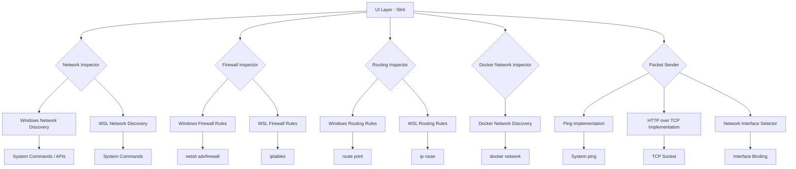

# WSLNetMan Architecture

## Component Diagram

## Data Flow

1. **UI Layer**: Built with Slint, provides the visual components
2. **Inspector Modules**: 
   - Network discovery for both Windows and WSL
   - Firewall rule inspection
   - Routing table inspection
   - Docker network inspection
3. **Packet Sender**: 
   - Implements ping functionality
   - Implements HTTP over TCP
   - Handles network interface selection
4. **System Integration**: 
   - Uses system commands and APIs to gather information
   - Requires elevated privileges for some operations

## Key Technical Considerations

1. **Cross-platform Compatibility**: 
   - Application runs on Windows but is developed on WSL
   - Must handle both Windows and WSL network interfaces

2. **Privilege Requirements**: 
   - Firewall inspection may require admin privileges
   - Routing table access may require elevated permissions
   - Packet sending from specific interfaces may require special permissions

3. **Network Interface Selection**: 
   - Binding to specific network interfaces for packet sending
   - Mapping between Windows and WSL network interfaces

4. **Docker Integration**: 
   - Accessing Docker network information
   - Handling container network namespaces